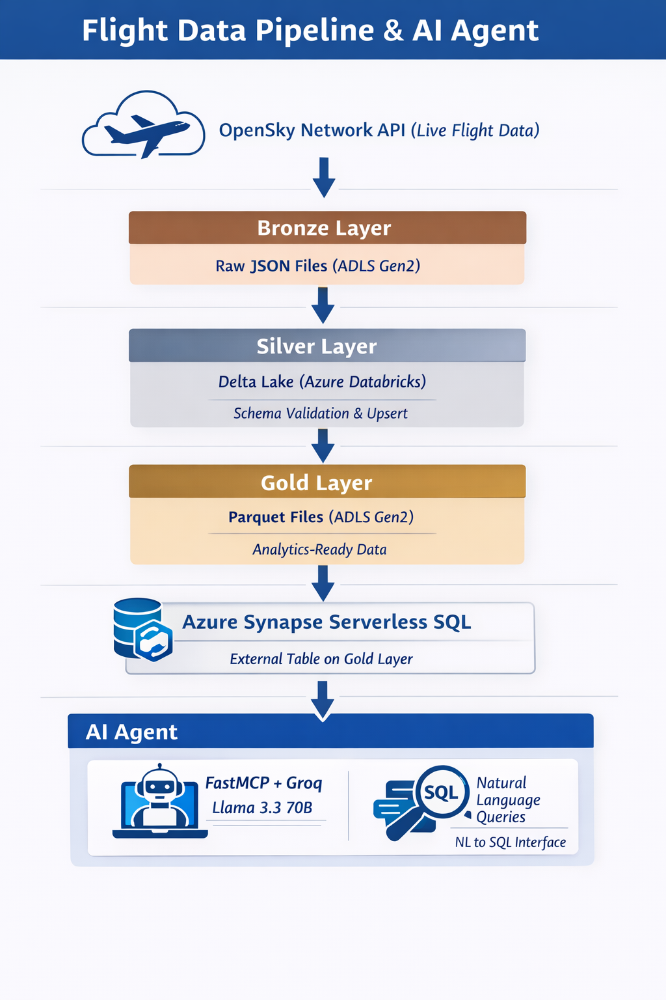

# Flight Data Pipeline & AI Agent

An end-to-end data engineering project built on Azure implementing medallion 
architecture with an AI-powered natural language query interface for live 
global flight data.

## Architecture
```
OpenSky Network API (Live Flight Data ~11,000 records per call)
           ↓
    Bronze Layer (ADLS Gen2)
    Raw JSON snapshots every 10 mins
           ↓
    Silver Layer (Delta Lake - Azure Databricks)
    Schema validation, DQ checks,
    status logic, merge/upsert
           ↓
    Gold Layer (Parquet - ADLS Gen2)
    Analytics-ready, filtered dataset
           ↓
    Azure Synapse Serverless SQL
    External table on Gold Parquet
           ↓
    AI Agent (Local Python + FastMCP + Groq)
    Natural language to SQL interface
```

## Tech Stack

| Layer | Technology |
|---|---|
| Ingestion | Python, OpenSky Network API |
| Storage | Azure Data Lake Storage Gen2 |
| Processing | Azure Databricks, PySpark |
| Data Format | Delta Lake (Silver), Parquet (Gold) |
| Query Engine | Azure Synapse Serverless SQL |
| Orchestration | Databricks Workflows (every 30 mins) |
| Secret Management | Azure Key Vault |
| AI Agent | Python, FastMCP, Groq (Llama 3.3 70B) |
| Version Control | GitHub + Databricks Repos |

## Medallion Architecture

### Bronze Layer
- Fetches live global flight data from OpenSky Network API
- Saves raw JSON to ADLS Gen2 with timestamp
- Runs every 30 minutes via Databricks Workflow
- Writes run_config.json for downstream layers

### Silver Layer
- Reads raw JSON from Bronze via run_config.json
- Schema validation and type casting
- Data quality checks — null validation, geo coordinate validation
- Bad records logged to ADLS
- Flight status logic:
  - AIRBORNE — in air, recent contact
  - LANDED — on ground flag
  - INACTIVE — no contact more than 3 hours
  - EXPIRED — no contact more than 6 hours
- Source type mapping — ADS-B, ASTERIX, MLAT, FLARM
- Delta Lake upsert/merge on icao24

### Gold Layer
- Filters EXPIRED records
- Selects analytics relevant columns
- Saves as Parquet — full overwrite each run
- Queried by Synapse and AI Agent

## AI Agent

- Natural language to SQL using Groq LLM (Llama 3.3 70B)
- FastMCP protocol with two tools:
  - get_schema — returns Gold layer schema to LLM
  - validate_and_execute_query — validates and executes SQL on Synapse
- SQL injection protection — blocked keywords and regex patterns
- Connects directly to Azure Synapse Serverless
- Runs locally via terminal

### Example queries

- How many flights are currently airborne over India?
- Which country has the most flights right now?
- Show me all INACTIVE flights
- What percentage of flights use ADS-B tracking?

## Project Structure
```
de_project/
├── src/                        
│   ├── api/
│   │   └── fetch_api_data.py          
│   ├── processing/
│   │   ├── transform_data.py          
│   │   └── gold_layer_creation.py     
│   ├── agent/
│   │   ├── mcp_server.py              
│   │   └── agent.py                   
│   └── utils/
│       └── logger.py                  
├── databricks_src/             
│   ├── api/
│   │   └── fetch_api_data.py
│   ├── processing/
│   │   ├── transform_data.py
│   │   └── gold_layer_creation.py
│   └── utils/
│       └── logger.py
├── config.yaml                 
├── requirements.txt
├── .env                        
├── .gitignore
└── README.md
```

## Setup

### Prerequisites
- Azure subscription
- Azure Databricks workspace
- Azure Data Lake Storage Gen2
- Azure Synapse Analytics
- Azure Key Vault
- Python 3.8+
- Groq API key (free at console.groq.com)

### Azure Setup
1. Create ADLS Gen2 storage account
2. Create Databricks workspace
3. Create Key Vault and add ADLS access key as secret
4. Create Databricks secret scope backed by Key Vault
5. Configure Databricks cluster Spark config with secret scope
6. Link GitHub repo to Databricks Repos
7. Create Synapse workspace connected to ADLS
8. Create external table on Gold Parquet

### Local Setup
```bash
git clone https://github.com/sarthakmadan1999/de_project.git
cd de_project
pip install -r requirements.txt
```

Create .env file:
```
SYNAPSE_SERVER=de-synapse-project.sql.azuresynapse.net
SYNAPSE_DB=flight_db
SYNAPSE_USER=sqladminuser
SYNAPSE_PASSWORD=your-password
GROQ_API_KEY=your-groq-api-key
```

Run agent:
```bash
python -m src.agent.agent
```

## Key Design Decisions

**Why Delta Lake for Silver?**
ACID transactions, time travel, and upsert capability — essential for 
handling duplicate flight records across runs without data loss.

**Why Parquet for Gold?**
Read optimized format for Synapse Serverless — faster and cheaper 
than Delta for analytical queries.

**Why FastMCP for AI Agent?**
MCP is an open standard for LLM tool calling — any MCP compatible 
LLM can use the tools. More portable than custom implementations.

**Why separate src and databricks_src?**
Clean separation of local and cloud environments — same business logic, 
different runtime adapters. No code mixing.

**Why Groq?**
Free tier with Llama 3.3 70B — strong SQL generation capability with 
very fast inference. Suitable for interactive NL to SQL queries.

## Architecture


## Background

Built as a personal learning project to explore Azure data services 
after 4 years of production experience on AWS (S3, EMR, Redshift, Glue). 
Focus on Azure Databricks, Delta Lake, ADLS Gen2, Synapse Analytics, 
and AI agent integration using MCP protocol.

## Author
Sarthak Madan — Data Engineer II
GitHub: github.com/sarthakmadan1999

## Future Scope

- **Streaming Pipeline** — replace batch ingestion with real time 
  streaming using Azure Event Hubs and Spark Structured Streaming
  
- **Terraform IaC** — infrastructure as code for reproducible 
  Azure resource deployment
  
- **Power BI Dashboard** — connect Synapse to Power BI for 
  visual flight analytics and real time maps
  
- **CI/CD Pipeline** — GitHub Actions to automatically test 
  and deploy code changes to Databricks
  
- **Data Quality Monitoring** — Great Expectations or Azure 
  Monitor for automated DQ alerting
  
- **Multi Region Support** — extend pipeline to handle 
  regional flight data with geo partitioning
  
- **Vector Search** — semantic search on flight routes 
  using embeddings for intelligent querying
  
- **MCP Server Deployment** — containerize MCP server 
  using Azure Container Apps for cloud deployment
